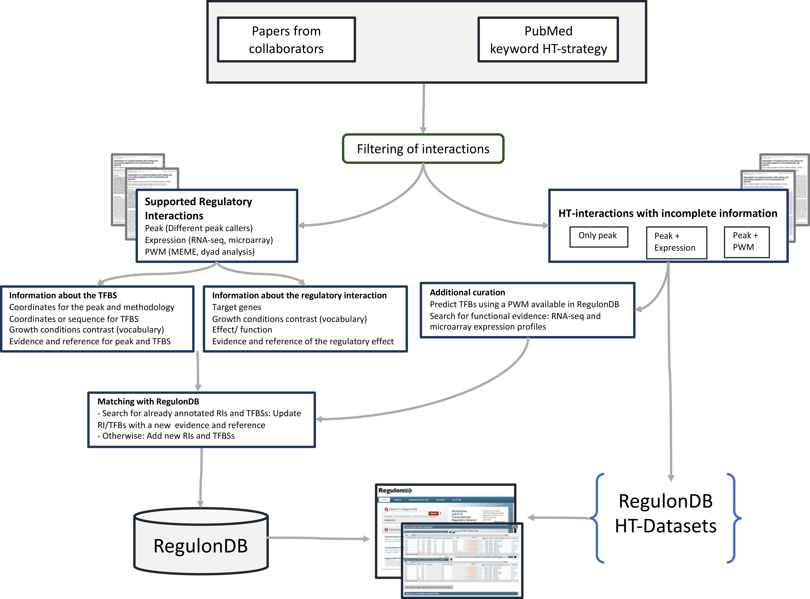

  

<h1> 
WorkFlow for the annotation of HT experiments in RegulonDB</h1>

 
<h3>INTRODUCTION</h3>
 

The process for the annotation of HT experiments in RegulonDB starts by searching literature in PubMed. We collect publications involving the HT-methodologies (ChIP-chip, ChIP-seq, ChIP-exo, Selex, RNA-seq, Microarrays, Hi-C, IPOD, NET-seq, TraDIS, ChAP-seq, CLIP-seq, Bisulfite-seq, Genotyping and RIP-seq). Searches are performed looking for the term "coli" in the title or in the abstract, and the name of the method or different synonyms or keywords related to the method in all fields of publications. This strategy usually give us repeated studies; thus, we filter the unique results. We read the abstracts and eliminate all those papers not reporting experiments explicitly performed in E. coli. Finally, we filter once again the repeated studies among all considered techniques.
Frequently, the papers include additional experimental characterization for a subset of the sites based on results of electrophoretic mobility shift assays, footprinting analysis, and bioinformatics tools, primarily via use of position weight matrices (PWMs) for the TFBSs to precisely identify the binding sites in the sequences of the peak regions. Curation of this literature extracted from each publication include the following metadata: the strain, growth condition, number of targets, name of the TF, methodology used (ChIP-X or gSELEX) or RNA-seq and its evidence code, additional techniques used to further identify the binding sites, as well as links to the files, when available, in the repositories of GEO or ArrayExpress. The growth condition and strain are described using the controlled vocabulary defined by Tierrafría et. al. The products of curation are added to RegulonDB either together with the classic curation or as a separate dataset. For those added to the classic curation, the information includes on the one hand information about the binding such as: coordinates for the peak and methodology, coordinates or sequence for TFBS, growth conditions, evidence and reference; as well as information about the regulatory interaction: target genes, methodology, growth conditions contrast (frequently comparing expression of overexpressed TF vs its mutant knockout), effect or function, evidence and reference of the regulatory effect. 

 
<h3>PROTOCOL STEPS</h3>
  

 
Figure 1. Annotation process workflow

 

1.	Searching gene expression on HT papers. 
2.	Classification of HT papers set 
3.	Curation process 
&nbsp;&nbsp;&nbsp;&nbsp;3.1.	Papers-HT with RIs 
&nbsp;&nbsp;&nbsp;&nbsp;&nbsp;&nbsp;&nbsp;&nbsp;3.1.1.	Curation of the TFBS 
&nbsp;&nbsp;&nbsp;&nbsp;&nbsp;&nbsp;&nbsp;&nbsp;3.1.2.	Curation of the RI 
&nbsp;&nbsp;&nbsp;&nbsp;&nbsp;&nbsp;&nbsp;&nbsp;3.1.3.	Searching already curated RIs or TFBs in RegulonDB 
&nbsp;&nbsp;&nbsp;&nbsp;&nbsp;&nbsp;&nbsp;&nbsp;3.1.4.	Including the RIs and the TFBS in RegulonDB database 
&nbsp;&nbsp;&nbsp;&nbsp;&nbsp;&nbsp;&nbsp;&nbsp;3.1.5.	Searching the HT RIs and TFBs in RegulonDB interface 
&nbsp;&nbsp;&nbsp;&nbsp;3.2.	Papers-HT only with interactions 
&nbsp;&nbsp;&nbsp;&nbsp;&nbsp;&nbsp;&nbsp;&nbsp;3.2.1.	Integrating information from different methodologies for the TFBS 
&nbsp;&nbsp;&nbsp;&nbsp;&nbsp;&nbsp;&nbsp;&nbsp;3.2.2.	Additional Curation of the TFBS 
&nbsp;&nbsp;&nbsp;&nbsp;&nbsp;&nbsp;&nbsp;&nbsp;3.2.3.	Including the TFBS in the RegulonDB HT-Datasets 
&nbsp;&nbsp;&nbsp;&nbsp;&nbsp;&nbsp;&nbsp;&nbsp;3.2.4.	The RegulonDB HT-Datasets home page. 

 