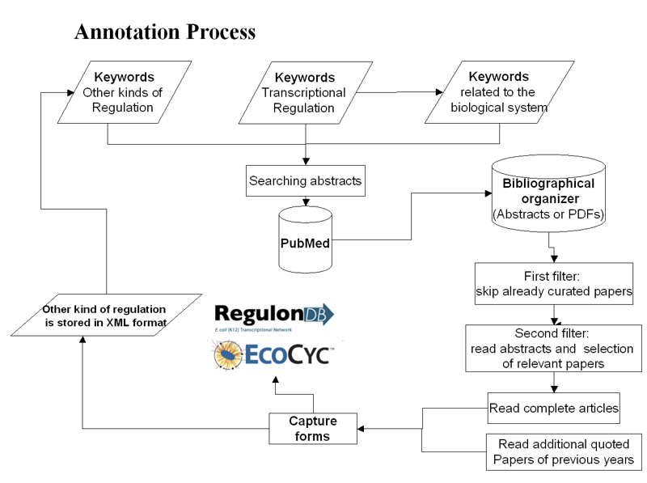

<h1>Annotation Process</h1>

<h3>THE ANNOTATION PROCESS</h3>

The team of curators in the Program of Computational Genomics at the Center for Genomic Sciences, Universidad Nacional Autónoma de México, takes care of the following annotation process focused on transcriptional regulation and operon organization.
 
 
The curation process starts by searching all articles that contain information about transcriptional regulation and operon organization.
The first step of this search is to gather abstracts from PubMed database by using a set of pertinent keywords. Then, the abstracts of these papers are read and selected to obtain the complete articles in order to read them.
Finally, the data extracted is added to EcoCyc through capture forms and the data flows from EcoCyc to RegulonDB previous to each release.
The releases are synchronized to contain the same data.
 
 
The quality control of the data added is monitored automatically through reports of incosistency in the data. Curation in our team is coordinated with colleagues in EcoCyc, so that we curate information on regulation of transcription initiation and operon organization.
Observations from users of both databases pertintent to gene regulation are unified and responded by our team. The team of curators follows a unified set of criteria or guidelines that are expanded as experience accumulates.
 

 
