<head>
    
     
</head>

        <h1>RegulonDB Glossary</h1>
    

&nbsp;
<table WIDTH="100%" class="table" >
<thead>
<tr>
<th align="center" background="/images/tableHeader.jpeg" class="titleWhite">Term</th>
<th align="center" background="/images/tableHeader.jpeg" class="titleWhite">Graphic representation in RegulonDB</th>
<th align="center" background="/images/tableHeader.jpeg" class="titleWhite">Description</th>
</tr>
</thead>    
<tr class="backGroundGray" NOSAVE>
<td VALIGN=TOP NOSAVE>

<b>
Gensor Unit</b>

</td>
<td align="center" valign="Top">
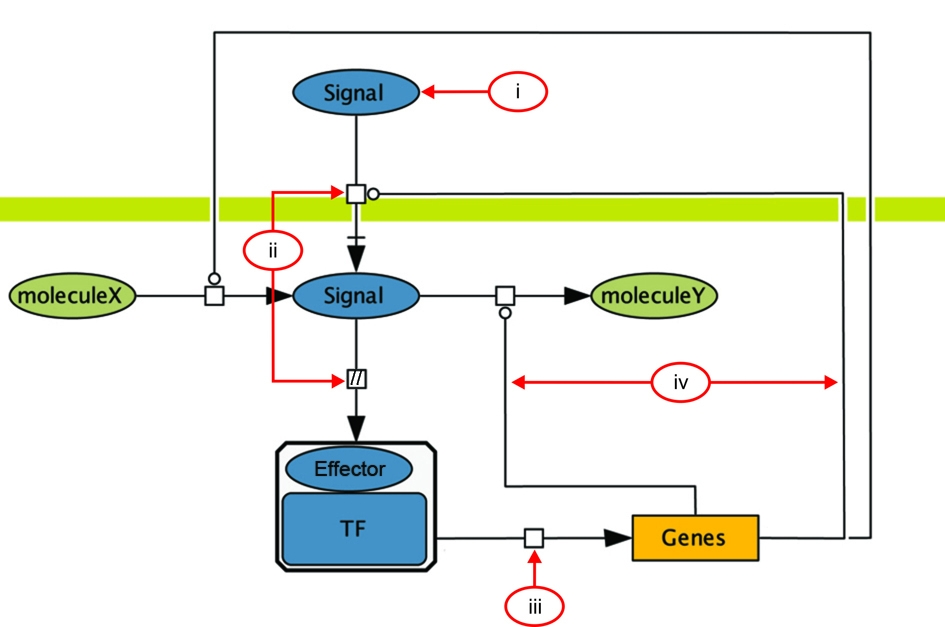
</td>
<td align="justify" NOSAVE>

The ability of a cell to respond to changes inside the cell or in the environment initiates when the new signal or stimulus is sensed and transmitted through a series of molecular concatenated reactions, called signal transduction or transduction pathways. These events bring into action genetic switches that modify gene expression to produce the adequate response to the cell. We call these processes genetic Sensory Response Units, or Gensor Unit.
 
Gensor Unit is defined by four components: i)the signal or stimulus, ii) the signal transduction pathway, iii) the regulatory mechanisms governing the expression of genes, and iv) the adequate response resulting from the modified gene expression of the affected set of target genes.

</td>
</tr>
<tr class="backGroundGray" NOSAVE>
<td VALIGN=TOP NOSAVE>

<b>
Operon</b>

</td>
<td align="center" valign="Top">
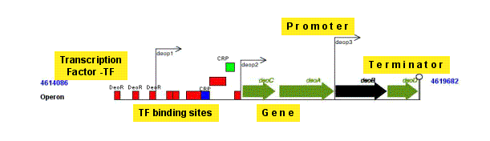
</td>
<td align="justify" NOSAVE>

An <b>operon</b> is a set of one or several genes and their associated regulatory elements, which are transcribed as a single unit. The classical definition of operon is a group of two or more genes transcribed as a polycistronic unit (Jacob and Monod, JMB, 1961). For database purposes only, we extended the definition in order to include the possibility of operons with only one gene.
Note:  An operon is, therefore, one or more contiguous genes transcribed in the same direction.
Please note that, according to this definition, an operon must contain a promoter upstream of all genes and a terminator downstream. It is also relatively common to find <B>operons with several promoters</B>, 
some of them internally located, thus, transcribing a partial group of genes. In all cases so far, one gene belongs to only one operon.

</td>
</tr>
<tr class="backGroundGray" NOSAVE>
<td VALIGN=TOP NOSAVE>

<b>Transcription
unit (TU)</b>

</td>
<td align="center">
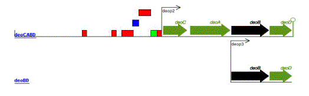
</td>
<td align="justify">

A<b>Transcription unit </b>is a
set of one or more genes transcribed from a single promoter. A TU may also include
regulatory protein binding sites affecting this promoter and a terminator.
Note: A complex operon with several promoters contains, therefore, several transcription units.  
According to  the definition of operon, at least one transcription unit must include all the genes in the operon. 
See for instance the 
<a href="/search?term=RPSU-DNAG-RPOD&organism=ECK12&type=operon">rpsU-dnaG-rpoD</a>, 
<a href="/search?term=GLNALG&organism=ECK12&type=operon">glnALG</a>, 
<a href="/search?term=FOCA-PFLB&organism=ECK12&type=operon">focA-pflB</a>, 

</td>
</tr>
<tr class="backGroundGray" >
<td VALIGN=TOP NOSAVE>

<b>Promoter</b>

</td>
<td align="center">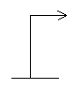</td>
<td align="justify" NOSAVE>

A<b>promoter</b> is the
DNA sequence where RNA polymerase binds and initiates transcription.
Notes: Promoter sequences are specific to the different sigma factors 
associated to the RNA polymerase core. A promoter is represented as a 
stretch of 60 upstream and 20 downstream upper-case nucleotide sequences 
from the precise initiation of transcription, also called +1.

</td>
</tr>
<tr class="backGroundGray" NOSAVE>
<td VALIGN=TOP  class="NormalText1" NOSAVE><b>TFs binding sites</b></td>
<td align="center">
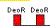
</td>
<td align="justify">

The<b>
TFs binding sites </b>are physical DNA sites recognized by transcription
factors within a genome.
  
Note: Historically, binding sites for transcriptional regulators were defined as operator sites. 
There are several meanings of an operator site. Operator sites in their wider meaning are sites 
for repressors or activators. Later on, the term "activator sites" was opposed to the term "operator sites",  
that was limited to sites for binding repressor regulators. In bacteria, specifically for Sigma 54 promoters, 
the term "UAS" for upstream activator sites is also used to refer to activator sites that function remotely. 
A related term is &quot;enhancers&quot;. An enhancer has been initially defined as an activator site that functions 
from far upstream, as well as  in either orientations in relation to the promoter.        

</td>
</tr>
<tr class="backGroundGray" NOSAVE>
<td VALIGN=TOP  class="NormalText1" NOSAVE><b>Gene</b>
</td>
<td align="center">
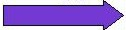
</td>
<td align="justify" class="NormalText">A <b>gene</b> is the segment of DNA involved in producing a polypeptide
chain or stable RNA; it includes regions preceding and following the coding
region (leader and trailer).
</td>
</tr>
<tr class="backGroundGray" NOSAVE>
<td VALIGN=TOP NOSAVE>

<b>
Transcription Factor (TF)
</b>

</td>
<td align="center">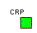</td>
<td align="justify">

A
<b>Transcription Factor (TF) or regulatory protein </b>is a protein
(more precisely a complex protein, since it can be a dimer or multimer)
that activates or represses the transcription of a TU upon binding to
specific DNA sites.

</td>
</tr>
<tr class="backGroundGray" NOSAVE>
<td VALIGN=TOP class="backGroundGray" NOSAVE>

<b>
Riboswitch</b>
<b>
</b>

</td>
<td align="center">

</td>
<td align="justify">

A
<b>Riboswitch </b>

For each group of orthologous proteins, the upstream regions of the first gene
of each operon are taken and  searched for motifs using MEME (Figure 1a). Each motif is then refined
by several cycles of locating it among all upstream regions from all bacteria using MAST, and
redefining a more specific motif with MEME (Figure 1b). Sequences with motifs can then be analyzed
to see if they present evidence of conserved secondary structure (Figure 1c). Predicted motifs are
also compared against the Rfam database to locate known structured elements and against RegulonDB to
find known transcription factor binding sites.

 <a href=""onClick="window.open('/search/jsp/openImage.jsp?img=glossary-of-regulondb-images/riboswitch_prediction_image.png','Riboswitches Prediction Image','width=667,height=260', menubar='no')">Click here to see image.</a>

</td>
</tr>
<tr class="backGroundGray" NOSAVE>
<td VALIGN=TOP class="backGroundGray" NOSAVE>

<b>
Attenuator</b>
<b>
</b>

</td>
<td align="center">

</td>
<td align="justify">

An
<b> Attenuator</b>

For each predicted operon, the upstream region of the first gene is taken (Figure 1a).
For every run of Us present in this region (Figure 1b), a stable structure in the adjacent region
is searched for (Figure 1c). If a terminator is found, an anti-terminator is searched for it
must be overlapping with the terminator (Figure 1d). An anti-antiterminator can be analogously
located by finding a structure that overlaps with the anti-terminator (Figure 1e).
For the particular case of translational attenuators, a terminator is searched for
that overlaps with the Shine-Dalgarno site.

<a href="" onClick="window.open('/search/jsp/openImage.jsp?img=/menu/using_regulondb/tutorials/project_glossary/images/attenuator_prediction_image.png','Attenuators Prediction Image','width=786,height=321', menubar='no')">Click here to see image.</a> 

</td>
</tr>
<tr class="backGroundGray" NOSAVE>
<td VALIGN=TOP class="backGroundGray" NOSAVE>

<b>
Terminator</b>
<b>
</b>

</td>
<td align="center">

</td>
<td align="justify">

A
<b>Terminator </b>is
the region where transcription ends and RNAP unbinds from DNA.

</td>
</tr>
<tr class="backGroundGray" NOSAVE>
<td VALIGN=TOP NOSAVE>

<b>
Small RNAs</b>

</td>
<td align="center">
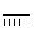
</td>
<td align="justify">

<b>Small RNAs</b> (sRNAs) are RNAs that have a regulatory role in  gene expression.
These RNAs are around  350 nucleotides and are not translated into protein.
This kind of RNA was named miRNA in eukaryotes and sRNA in bacteria.
	  
</td>
</tr>
<tr class="backGroundGray" NOSAVE>
<td VALIGN=TOP class="NormalText1" NOSAVE><b>Product</b>
</td>
<td></td>
<td align="justify">
 
 
A <b>Product</b> is the RNA or protein produced
based on the gene template.&nbsp;

</td>
</tr>
<tr class="backGroundGray" NOSAVE>
<td VALIGN=TOP NOSAVE>

<b>
Shine-Dalgarno</b>

</td>
<td  class="NormalText">

ggctagc<b>AGGAGG</b>gcatcac<b>ATG</b>

</td>
<td align="justify">

&nbsp;
 

<b>Shine-Dalgarno
or Ribosome binding site</b> is the polypurine sequence
and its consensus is AGGAGG. It is located on bacterial mRNA, just prior to an AUG initiation codon;
it is complementary to the sequence at the 3' end of 16S rRNA; involved
in binding of ribosome to mRNA.

</td>
</tr>
<tr VALIGN=TOP class="backGroundGray" NOSAVE>
<td NOSAVE>

<b>
Regulon</b>

<b>
Simple</b>

<b>
Complex</b>

</td>
<td align="center">
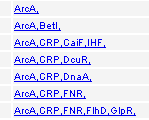
</td>
<td align="justify">

&nbsp;
 

Regulon is defined as a set of genes subject to regulation of one and only one regulator 
(<a href="http://www.pubmedcentral.gov/articlerender.fcgi?tool=pubmed&pubmedid=7854250">Maas WK</a>
, 1964, PMID:<a href="http://www.ncbi.nlm.nih.gov/entrez/query.fcgi?cmd=Retrieve&db=pubmed&dopt=Abstract&list_uids=14168690&query_hl=13">14168690</a>). 
Note: The initial definition was derived from studies of the arginine biosynthetic genes, which were, contrary to operons, found to be scattered (non contiguously located) in the chromosome of<em> E.coli</em>.  To better describe the alternative groups of co-regulated genes, we now call this a simple regulon, as opposed to a complex regulon.
 
<b>Complex regulon</b> 
A group of genes subject to regulation by two or more regulators, where all genes are subject to the regulation of exactly the same transcription factors.
 
<b>Strict complex regulon: </b> 
Complex regulons can still be subdivided into strict complex regulons. A strict complex regulon is a set of genes subject to regulation by two or more transcription factors, where the effect of each regulator (activator or repressor) is the same for all the regulated genes.

</td>
</tr>
<tr class="backGroundGray" NOSAVE>
<td VALIGN=TOP  class="NormalText1" NOSAVE><b>Matrix</b></td>
<td  align="center">
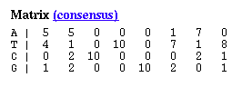
</td>
<td align="justify">
 
A&nbsp; <b>matrix</b>,
weight matrix, or positional weight matrix represents a collection of
aligned binding sequences for the same transcriptional regulator. It is
a derivative of a multiple alignment of such sites. Each row corresponds
to one of the letters of the relevant alphabet -e.g., 4 rows in the case
of DNA. Each column corresponds to one of the positions within the
aligned sites.&nbsp; A frequency matrix contains the frequency of the
four nucleotides at each position. 

</td>
</tr>
<tr class="backGroundGray" NOSAVE>
<td VALIGN=TOP NOSAVE>

<b>
Alignment</b>

</td>
<td align="center">
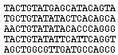
</td>
<td align="justify">
A multiple <b>alignment</b> with the collection
of binding sites for a regulatory protein is generated by using initially
extended binding sites. RegulonDB contains such mutiple alignments, generated
by using the Wconsensus program 
(<a href="http://www.ncbi.nlm.nih.gov/entrez/query.fcgi?cmd=Retrieve&db=pubmed&dopt=Abstract&list_uids=2193692&query_hl=4" class="linkBlue">Hertz
GZ, Comput Appl Biosci. 1990 Apr;6(2):81-92.</a>)
</td>
</tr>
<tr class="backGroundGray" NOSAVE>
<td VALIGN=TOP NOSAVE>

<b>
Growth condition</b>

</td>
<td></td>
<td align="justify">
 
<b>Growth conditions&nbsp;</b>are the
experimental conditions in which a strain is grown in particular experiments
performed to study  changes in gene expression.

</td>
</tr>
<tr class="backGroundGray" NOSAVE>
<td VALIGN=TOP NOSAVE>

<b>
Allosteric regulation of RNAP</b>

</td>
<td align="center">
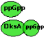
</td>
<td align="justify">
The small nucleotide ppGpp (guanosine tetraphosphate) is a global regulator of gene expression in bacteria. This is the effector molecule of the stringent control response. 
DksA: a partner to ppGpp, belongs to a class of bacterial regulators that do not interact with the nucleic acids and instead directly bind in the RNA polymerase. 
DksA cooperates with ppGpp responding to the level of ppGpp to regulate the expression of particular genes. The DksA protein binds directly to RNA polymerase, affecting transcript elongation and augmenting the effect of the alarmone ppGpp on transcription initiation.

</td>
</tr>
<tr class="backGroundGray" NOSAVE>
<td VALIGN=TOP NOSAVE>

<b>
Incomplete gene</b>

</td>
<td align="center">

</td>
<td align="justify">
Incomplete gene (indicated by zig-zag line) contained in a displayed region.

</td>
</tr>
<tr class="backGroundGray" NOSAVE>
<td VALIGN=TOP NOSAVE>

<b>
Effector</b>

</td>
<td align="center">

</td>
<td align="justify">

We call effector in RegulonDB the precise metabolite that binds to the TF, altering its conformation and involved in the switch for 
the binding-unbinding specifically to its TFBSs sites. Most effectors are metabolites that bind non-covalently to an allosteric TF 
site. We include as effectors covalent modifications, i.e. phosphorylations for the two component TFs.
 
The literature may be confusing since effectors are also called "signals". A signal in RegulonDB is distinguished clearly from 
effectors. See GUs for more detail.

</td>
</tr>
</table>

