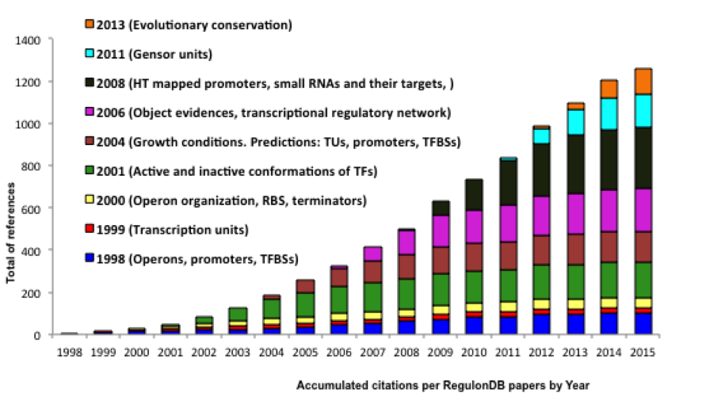

  

<h1>Impact of RegulonDB</h1>

 
 

RegulonDB is the gold standard resource on regulation of transcription initiation that integrates the scattered scientific knowledge of the best-characterized organism, the bacterium Escherichia coli K-12. Its electronic format enables researchers to compare their results with the legacy of previous knowledge and supports implementation of bioinformatics tools and model building.
 
RegulonDB plays a central role in the development and testing of novel approaches of gene regulation in bioinformatics, comparative genomics and systems biology, and is the model to inspire similar approaches and studies for any other organism, including pathogenic bacteria ((Shen-Orr et al., 2002), (Barabasi and Oltvai, 2004), (Isalan et al., 2008) ). Evidence of its usefulness is the more than 1200 citations in published articles, in addition to the many citations to the EcoCyc database, which incorporates our curation work. 

 

 

 Accumulated citations per RegulonDB papers by year and the concomitant expansion of domains of the biology that we keep addressing. 
 

 

<table class="table" >
<thead>
  <tr>
    <th>Reference(s)</th>
  </tr>
</thead>
<tbody>
  <tr>
    <td>&nbsp;Isalan, M., C. Lemerle, K. Michalodimitrakis, C. Horn, P. Beltrao, E. Raineri, M. Garriga-Canut and L. Serrano (2008). "Evolvability and hierarchy in rewired bacterial gene networks". Nature. 452(7189): 840-U842.</td>
  </tr>
  <tr>
    <td>&nbsp;Barabasi, A. L. and Z. N. Oltvai (2004). "Network biology: Understanding the cell's functional organization". Nature Reviews Genetics. 5(2): 101-U115.</td>
  </tr>
  <tr>
    <td>&nbsp; Shen-Orr, S. S., R. Milo, S. Mangan and U. Alon (2002). "Network motifs in the transcriptional regulation network of Escherichia coli". Nature Genetics. 31(1): 64-68.</td>
  </tr>
</tbody>
</table>
