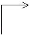
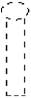
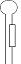
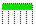
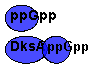
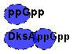

Graphic code for objects and colors  

 

<table WIDTH="90%" class="table">
        <tr class="backGroundTitleBlue2">   
            <th>Biological Name 
                <a target="_blank" href="/menu/using_regulondb/tutorials/project_glossary/index.jsp"style="color: #FFFFFF">(see
                RegulonDB glossary)</a></th>
            <th >Properties</th>
            <th >Graphic feature, strong evidence</th>
            <th >Graphic feature, weak evidence</th>
        </tr>
        <tr>
            <td class="NormalText">Promoter</td>
            <td class="NormalText">Not applicable</td>
            <td  class="NormalText">

</td>
            <td  class="NormalText">

</td>
        </tr>
        <tr>
            <td class="NormalText" rowspan="4">TF binding site</td>
            <td class="NormalText">Activator</td>
            <td class="NormalText">

</td>
            <td class="NormalText">

</td>
        </tr>
        <tr>
            <td class="NormalText">Dual</td>
            <td class="NormalText">

</td>
            <td class="NormalText">

</td>
        </tr>
        <tr>
            <td class="NormalText">Repressor</td>
            <td class="NormalText">  

</td>
            <td class="NormalText">  

</td>
        </tr>
        <tr>
            <td class="NormalText">Unknown</td>
            <td class="NormalText">

</td>
            <td class="NormalText">

</td>
        </tr>
        <tr>
            <td class="NormalText">Terminator</td>
            <td class="NormalText">Not applicable</td>
            <td class="NormalText">

</td>
            <td class="NormalText">

</td>
        </tr>
        <tr>
            <td class="NormalText">Riboswitch</td>
            <td class="NormalText">Not applicable</td>
            <td class="NormalText">

</td>
            <td class="NormalText">

</td>
        </tr>
        <tr>
            <td class="NormalText">Translational attenuator</td>
            <td class="NormalText">Not applicable</td>
            <td>

</td>
            <td>

</td>
        </tr>
        <tr>
            <td class="NormalText">Transcriptional attenuator</td>
            <td class="NormalText">Not applicable</td>
            <td>

</td>
            <td>

</td>
        </tr>
        <tr>
            <td class="NormalText" rowspan="2">Gene</td>
            <td class="NormalText">Complete gene<A HREF="#ancla_complete_gene"> (Color Code)</A></td>
            <td>

</td>
            <td>

</td>
        </tr>
        <tr>
            <td class="NormalText">Incomplete gene<A HREF="#ancla_Incomplete_gene"> (Color Code)</A></td>
            <td>

</td>
            <td>

</td>
        </tr>
        <tr>
            <td class="NormalText" rowspan="4">Small RNA binding site</td>
            <td class="NormalText">Activator</td>
            <td>

</td>
            <td>

</td>
        </tr>
        <tr>
            <td class="NormalText">Dual</td>
            <td>

</td>
            <td>

</td>
        </tr>
        <tr>
            <td class="NormalText">Repressor</td>
            <td>

</td>
            <td>

</td>
        </tr>
        <tr>
            <td class="NormalText">Unknown</td>
            <td>

</td>
            <td>

</td>
        </tr>
        <tr>
            <td class="NormalText" rowspan="4">Allosteric regulation of RNAP</td>
            <td class="NormalText">Activator</td>
            <td>

</td>
            <td>

</td>
        </tr>
        <tr>
            <td class="NormalText">Dual</td>
            <td>

</td>
            <td>

</td>
        </tr>
        <tr>
            <td class="NormalText">Repressor</td>
            <td>

</td>
            <td>

</td>
        </tr>
        <tr>
            <td class="NormalText">Unknown</td>
            <td>

</td>
            <td>

</td>
        </tr> 
        <tr >
            <th colspan="4" class="backGroundTitleBlue2">Color code used in graphs of TFBSs arrangements section, from Regulon search.</th>
        </tr>
        <tr>
            <td class="NormalText"rowspan="4"> <a name="ancla_regulon_search"/>TF binding site</td>
            <td class="NormalText">Activator</td>
            <td>

</td>
            <td>

</td>
        </tr>
        <tr>
            <td class="NormalText">Dual</td>
            <td>

</td>
            <td>

</td>
        </tr>
        <tr>
            <td class="NormalText">Repressor</td>
            <td>

</td>
            <td>

</td>
        </tr>
        <tr>
            <td class="NormalText">Unknown</td>
            <td>

</td>
            <td>

</td>
        </tr>
</table>
 

COLOR CODE

<table width="90%" class="table">  
  <tr class="backGroundTitleBlue2">      
    <th width="13%">Color class:</th>      
    <th width="87%">Description:</th>
  </tr>
  <tr> 
    <td ></td> 
    <td class="NormalText">&nbsp;&nbsp;Metabolism	</td>  
  </tr>
  <tr> 
        <td ></td> 
        <td class="NormalText" >
                &nbsp;&nbsp;&nbsp;&nbsp;1.1 Carbon compound utilization
        </td>  
    </tr>
    <tr> 
        <td >
             </td> <td class="NormalText" >
              &nbsp;&nbsp;&nbsp;&nbsp;1.3 Energy metabolism (carbon)
        </td>  
    </tr>
    <tr> 
        <td ></td> 
        <td class="NormalText" >
                &nbsp;&nbsp;&nbsp;&nbsp;1.4 Energy production/transport
        </td>  
    </tr>
    <tr> 
        <td ></td> 
        <td class="NormalText" >
                &nbsp;&nbsp;&nbsp;&nbsp;1.7 Central intermediary metabolism
        </td>  
    </tr>
    <tr> 
        <td ></td> 
        <td class="NormalText" >
                &nbsp;&nbsp;&nbsp;&nbsp;1.2 Macromolecule degradation
        </td>  
    </tr>
    <tr> 
        <td ></td> 
        <td class="NormalText" >
            &nbsp;&nbsp;&nbsp;&nbsp;1.6 Macromolecules (cellular constituent)  biosynthesis
        </td>  
    </tr>
    <tr> 
        <td ></td> 
        <td class="NormalText" >
                &nbsp;&nbsp;&nbsp;&nbsp;1.5 Building block biosynthesis
        </td>  
    </tr>
    <tr> 
        <td ></td> 
        <td class="NormalText" >
                &nbsp;&nbsp;&nbsp;&nbsp;1.8 Metabolism of other compounds
        </td>  
    </tr>
    <tr> 
        <td ></td> 
        <td class="NormalText" >&nbsp;&nbsp;Information transfer 	</td>  </tr>
    <tr> 
        <td ></td> <td class="NormalText" >
               &nbsp;&nbsp;&nbsp;&nbsp;2.1 DNA related
        </td>  
    </tr>
    <tr> 
        <td ></td> 
        <td class="NormalText" >
                &nbsp;&nbsp;&nbsp;&nbsp;2.2 RNA related
        </td>  
    </tr>
    <tr> 
        <td ></td> <td class="NormalText" >
                <A NAME="ancla_Incomplete_gene">&nbsp;&nbsp;&nbsp;&nbsp;2.3 Protein related</A>
        </td>  
    </tr>
    <tr> 
        <td >
            </td>
        <td class="NormalText" >&nbsp;&nbsp;Regulation	
        </td> 
    </tr>
    <tr> 
        <td ></td> <td class="NormalText" >
             &nbsp;&nbsp;&nbsp;&nbsp;3.1. Type of regulation
        </td>  
    </tr>
    <tr> 
        <td ></td> 
        <td class="NormalText" >
           &nbsp;&nbsp;&nbsp;&nbsp;3.3 Genetic unit regulated
        </td>  
    </tr>
    <tr> 
        <td ></td> 
        <td class="NormalText" >
                &nbsp;&nbsp;&nbsp;&nbsp;3.4 Trigger (some information added)
        </td>  
    </tr>
    <tr> 
        <td ></td> <td class="NormalText" >
           &nbsp;&nbsp;&nbsp;&nbsp;3.5 Trigger modulation (some information added)
        </td>  
    </tr>
    <tr> 
        <td ></td> 
        <td class="NormalText" >&nbsp;&nbsp;Transport	</td>  </tr>
    <tr> 
        <td ></td> 
        <td class="NormalText" >
                &nbsp;&nbsp;&nbsp;&nbsp;4.1 Channel-type Transporters
        </td>  
    </tr>
    <tr> 
        <td >
            </td> <td class="NormalText" >
               &nbsp;&nbsp;&nbsp;&nbsp;4.2  Electrochemical potential driven transporters
        </td>  
    </tr>
    <tr> 
        <td ></td> 
        <td class="NormalText" >
              &nbsp;&nbsp;&nbsp;&nbsp;4.3 Primary Active Transporters
        </td>  
    </tr>
    <tr> 
        <td ></td> 
        <td class="NormalText" >
             &nbsp;&nbsp;&nbsp;&nbsp;4.4 Group Translocators
        </td>  
    </tr>
    <tr> 
        <td ></td> 
        <td class="NormalText" >
                &nbsp;&nbsp;&nbsp;&nbsp;4.8.A Accessory Factors Involved in Transport
        </td>  
    </tr>
    <tr> 
        <td ></td> 
        <td class="NormalText" >
               &nbsp;&nbsp;&nbsp;&nbsp;4.9.A Transporters of Unknown Classification
        </td>  
    </tr>
    <tr> 
        <td ></td> 
        <td class="NormalText" >
               &nbsp;&nbsp;&nbsp;&nbsp;4.5 Substrate
        </td>  
    </tr>
    <tr> 
        <td ></td> 
        <td class="NormalText" >&nbsp;&nbsp;Cell processes	</td>  
    </tr>
    <tr> 
        <td ></td> 
        <td class="NormalText" >
                &nbsp;&nbsp;&nbsp;&nbsp;5.1 Cell division
        </td>  
    </tr>
    <tr> 
        <td ></td> 
        <td class="NormalText" >
                &nbsp;&nbsp;&nbsp;&nbsp;5.2 Cell cycle physiology
                </td>  
    </tr>
    <tr> 
        <td ></td> 
        <td class="NormalText" >
                &nbsp;&nbsp;&nbsp;&nbsp;5.3 Motility (incl. chemotaxis, energytaxis, aerotaxis, redoxtaxis)
        </td>  
    </tr>
    <tr> 
        <td ></td> 
        <td class="NormalText" >
                &nbsp;&nbsp;&nbsp;&nbsp;5.4 Genetic exchange, recombination
        </td>  
    </tr>
    <tr> 
        <td ></td> 
        <td class="NormalText" >
               &nbsp;&nbsp;&nbsp;&nbsp;5.5 Adaptation to stress
            </td>  
    </tr>
    <tr> 
        <td ></td> 
        <td class="NormalText" >
                &nbsp;&nbsp;&nbsp;&nbsp;5.6 Protection
        </td>  
    </tr>
    <tr> 
        <td ></td> 
        <td class="NormalText" >
                &nbsp;&nbsp;&nbsp;&nbsp;5.8 SOS response
        </td>  
    </tr>
    <tr> 
        <td ></td> 
        <td class="NormalText" >
                &nbsp;&nbsp;&nbsp;&nbsp;5.10 Defense/survival
        </td>  
    </tr>
    <tr> 
        <td ></td> 
        <td class="NormalText" >
               &nbsp;&nbsp;&nbsp;&nbsp;5.11 DNA uptake
        </td>  
    </tr>
    <tr> 
        <td ></td>
        <td class="NormalText" >
                &nbsp;&nbsp;&nbsp;&nbsp;5.12 Biofilm production
        </td>  
    </tr>
    <tr> 
        <td ></td> 
        <td class="NormalText" >
              &nbsp;&nbsp;&nbsp;&nbsp;5.13 Virulence associated
        </td>  
    </tr>
    <tr> 
        <td ></td> 
        <td class="NormalText" >&nbsp;&nbsp;Cell structure	</td>  
    </tr>
    <tr> 
        <td ></td> 
        <td class="NormalText" >
                &nbsp;&nbsp;&nbsp;&nbsp;6.1 Membrane
        </td>  
    </tr>
    <tr> 
        <td ></td> 
        <td class="NormalText" >
               &nbsp;&nbsp;&nbsp;&nbsp;6.2 Peptidoglycan (murein)
        </td>  
    </tr>
    <tr> 
        <td ></td>
        <td class="NormalText" >
            &nbsp;&nbsp;&nbsp;&nbsp;6.3 Surface antigens (ECA, O antigen of LPS)
        </td>  
    </tr>
    <tr> 
        <td ></td> 
        <td class="NormalText" >
                <A NAME="ancla_complete_gene">&nbsp;&nbsp;&nbsp;&nbsp;6.4 Flagellum</A>
        </td>  
    </tr>
    <tr> 
        <td ></td>
        <td class="NormalText" >
               &nbsp;&nbsp;&nbsp;&nbsp;6.5 Pilus 
        </td>  
    </tr>
    <tr> 
        <td ></td> 
        <td class="NormalText" >
                &nbsp;&nbsp;&nbsp;&nbsp;6.6 Ribosome
        </td>  
    </tr>
    <tr> 
        <td ></td>
        <td class="NormalText" >
                &nbsp;&nbsp;&nbsp;&nbsp;6.7 Capsule (M and K antigens)
        </td>  
    </tr>
    <tr> 
        <td ></td> 
        <td class="NormalText" >&nbsp;&nbsp;Extrachromosomal	</td> 
    </tr>
    <tr> 
        <td ></td>
        <td class="NormalText" >&nbsp;&nbsp;DNA sites	</td>  
    </tr>
    <tr> 
        <td ></td> 
        <td class="NormalText" >&nbsp;&nbsp;Cryptic genes	</td> 
    </tr>
</table>

