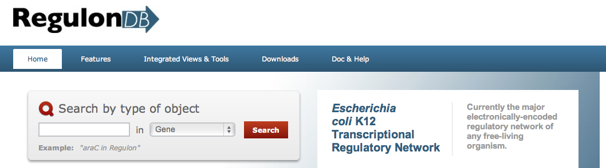
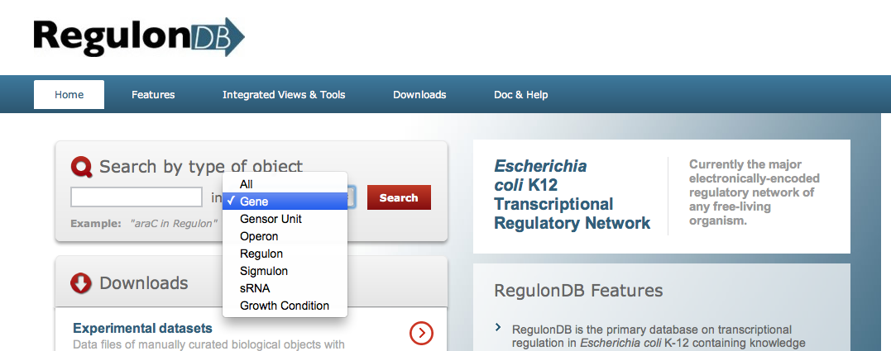

<h1>Get Started Using RegulonDB </h1>

 
<h2>Get Started </h2> 

With&nbsp; RegulonDB, you can get mechanistic information about operon organization and their decomposition into transcription units (TUs),promoters and their sigma type, genes and their ribosome binding sites, terminators, binding sites of specific transcriptional regulators (TRs),&nbsp; as well as their organization into regulatory phrases, active and inactive conformations of TRs and  simple and complex regulon

 To use RegulonDB, you need the following elements: 
 
<ul>
<li>
An Internet connection. A broadband Internet connection improves performance, but it is not necessary because RegulonDB transfers only small amounts of data (such as display data and keyboard data) to your computer.

 
</li>

The menu and tools of RegulonDB use JavaScript, for this reason, we recommend to use the latest version of Internet Explorer, Firefox, Safari or a similar browser.

 
</li>
</ul>

 
    This how-to article assumes your computer is part of a corporate network in which remote connections are permitted. If you are unsure, ask your system administrator.

<h2>Start a Search</h2> 

Once you have connected to RegulonDB home page, you are ready to start searching.  

<ol>

 <li>In the main page,&nbsp; go to the search menu</li>

 

 <li>The&nbsp; Search menu has eight options to search, choose one.
 
 
 
</li>

 In Gene search, you can get information related to the gene, gene product, Shine Dalgarno sequence, gene regulators, plus the operon and all transcription units the gene belongs to. You can also see a graphic display containing all objects located within the context region, including promoters, binding sites and terminators. This may also include sites with no effect on regulation of the query-gene. 

</li>

Operon search. A common definition of&nbsp; operon is: a set of contiguous genes co-transcribed in a given condition. For database purposes we define two terms in RegulonDB: operon and transcription unit, where operon is a set of one or more overlapping transcription units which share genes. In RegulonDB, one gene cannot belong to more than one operon. A <b>transcription unit </b>is a set of one or more genes transcribed from a single promoter. A TU may also include regulatory protein binding sites affecting this promoter and a terminator.&nbsp;  From this search, you can get information related to the operon, all the transcriptions units -TU- belonging to the operon, plus the&nbsp; regulation for each TU.&nbsp; The Operon graph is displayed with all the regulatory elements located within the context region.  The complete set of known transcriptions units are displayed below the operon with their detailed regulatory information.
</li>
<li>
In the _Regulon_ search, you can get  simple and complex regulon information.  The classic definition of a <b>regulon</b> is a group of genes regulated by one and only one transcription factor (Maas WK, 1964, PMID:<a href="http://www.ncbi.nlm.nih.gov/entrez/query.fcgi?cmd=Retrieve&amp;db=pubmed&amp;dopt=Abstract&amp;list_uids=14168690&amp;query_hl=13">14168690</a>).

We call this a simple regulon.

A <b>complex reg</b><b>u</b><b>lon</b> is defined as a group of genes regulated by several transcriptional regulators, where each regulator has the same effect on all the genes of the regulon.   All the binding sites and promoters grouped by function are displayed.
 
</li>
<li>
_Growth Condition_ search. At the present, this data can be accessed from download option, we are working to generate specific search and navigation tools.
 
</li>
</ol>
 